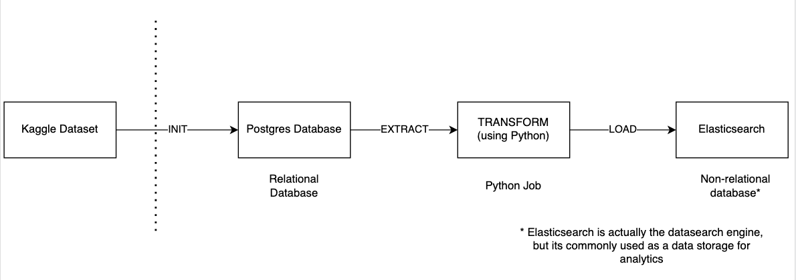

# Simple ETL Pipeline

This repository has been created for demonstrating some basic conception of performing Extract Transform and Load tasks 
using Python programming language in connection with Relational and Non-Relational Databases.

# Architecture graph

# Installation 

## Local development

Please make sure that you have Python 3.10 installed.
1. Before the installation it's good to create virtual environment for this project. From the local directory run:

`python -m venv .venv`

Activate it:

`source .venv/bin/activate`

2. Install all the required dependencies:

`pip install -r requirements.txt`
    
# Migration

Repository is using SqlAlchemy and Alembic in order to manage tables and for performing the migrations.
For further migration, please run: 

`alembic upgrade head`

For auto-generating the new revisions based on defined orm models, please run:

`alembic revision -m "your revision name" --autogenerate`
