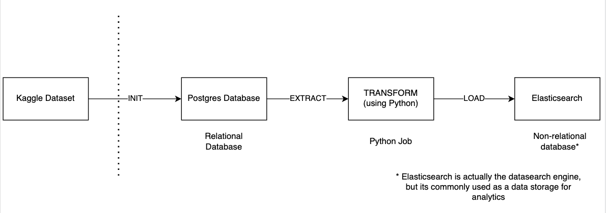

# Simple ETL Pipeline

This repository has been created for demonstrating some basic conception of performing Extract Transform and Load tasks 
using Python programming language in connection with Relational and Non-Relational Databases.

# Architecture graph

For auto-generating the new revisions based on defined orm models, please run:

`alembic revision -m "your revision name" --autogenerate`
