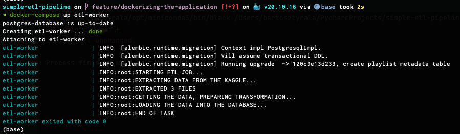

# Simple ETL Pipeline

This repository has been created for demonstrating some basic conception of performing Extract Transform and Load tasks 
using Python programming language in connection with Relational and Non-Relational Databases.

The aim is to (E)xtract all interesting information about the most popular playlists and artists from popular application Spotify.
For this we will use in project as a datasource the [Kaggle Spotify Daily Top 50 Of 59 countries + Global dataset](https://www.kaggle.com/datasets/bwandowando/daily-spotify-top-50-of-60-countries) and store it in a local directory.
This would be used as a read only Extraction data.

Next we will load this data into the Database Tables (staging data).

As a last step data will be Transformed and Load into the destination data engine tool Elasticsearch.

In further steps of the project data would be able to be visualised in Kibana as a dashboards.

# Architecture graph

# Installation 

## Running on Docker-compose

First edit env.dev file. For more details about your API KEY please read the guide below "Getting the source data".

    KAGGLE_USERNAME=<your_username>
    KAGGLE_KEY=<your_api_key>

To run the ETL job please follow the steps:

    docker-compose up -d postgres-database

After postgres will start run:

    docker-compose up etl-worker

Please note if you see error like and you are using mac M1:

_pg_connect(): Unable to connect to PostgreSQL server: SCRAM authentication requires libpq version 10 or above._

you will need to rebuild your images with environmental variable:

    export DOCKER_DEFAULT_PLATFORM=linux/amd64
    docker-compose build

## Local development

Please make sure that you have Python 3.10 installed.
1. Before the installation it's good to create virtual environment for this project. From the local directory run:

`python -m venv .venv`

Activate it:

`source .venv/bin/activate`

2. Install all the required dependencies:

`pip install -r requirements.txt`
    

# Getting the source data:

In order to fetch the data from the [Kaggle](https://www.kaggle.com) using the SDK you need to create your Api Token first.

Navigate to your [account settings](https://www.kaggle.com/<username>/account) and create the new API Token.

`account > Create New API Token `

Next before using the Kaggle command line tool export your credentials to the environmental variables:

    export KAGGLE_USERNAME=<username>
    export KAGGLE_KEY=<api_key>
    kaggle datasets list

We will use this dataset:

    https://www.kaggle.com/datasets/bwandowando/daily-spotify-top-50-of-60-countries

For downloading and unzipping it please run:

    kaggle datasets download -d bwandowando/daily-spotify-top-50-of-60-countries -q --unzip

# Migration

Repository is using SqlAlchemy and Alembic in order to manage tables and for performing the migrations.
For further migration, please run: 

`alembic upgrade head`

For auto-generating the new revisions based on defined orm models, please run:

`alembic revision -m "your revision name" --autogenerate`
